[TOC]

# :scroll: 5.28 复习
- 1/3 期中前, 2/3期中后

- 以下省略mooc部分
- 这只是个考点提纲
## 🌟01-课程概述-20250217
### :dizzy: 四个计算机及其特点
- ENIAC : 世界上第一台电子计算机
- EDVAC : 存储程序计算机(即冯·诺依曼结构)
  - feature : 存储程序、二进制、顺序执行
  - conponents : 输入设备、输出设备、存储器、运算器、控制器
- EDSAC : 第一台具有存储程序的通用计算机 
- UNIVAC : 第一台商用计算机
- 大型, 超级, 小型, 微型

## 🌟02-控制器的基本原理-20250317

期中考过了吧
## 🌟03-输入输出接口实例-20250409
具体接口不需要掌握
### :dizzy: 并行与串行比较
- 差分信号
- 可编程接口不要求

## 🌟04-总线与总线标准-20250428

### :dizzy: 总线
- 概念, 主模块, 从模块, 译码器, 仲裁器
### :dizzy: 总线标准
- 总线标准产生的途径, 标准的内容
### :dizzy: 时序图
不同场景
## 🌟05-中断控制器和定时器-20250512
### :dizzy: MIPS CPU 的异常处理
### :dizzy: 外部中断优先级
- 菊花链电路
- 早期和现在的中断控制器结构
### :dizzy: 定时器
- 不会考的很精确, 都是给定需求由我们选择方式
- 中断控制器和定时器在IBM PC/AT中的连接结构

## 🌟06-流水线优化技术-20250521
- x86第一代流水线 (图)
- 转移指令的影响
- 延迟转移技术
- 转移预测技术 (重点)
  - 优缺点
- 两位历史信息
- BTB 动作机制
- 返回地址栈

## 🌟07-计算机系统先进技术(1)-20250526
- 片上总线的缺点 & 片上网络出现
- DDR4 如何工作, 为什么不太合适继续加倍, 以及使用 Bank Grouping 技术
- MSI 中断机制 (为什么, 之前的机制有什么问题)
## 🌟08-计算机系统先进技术(2)-20250604
- 指令系统
- 并行结构

# :scroll: 4.23 HBM 讲座

## :star2: HBM 技术
面向人工智能的芯片

### :dizzy: Motivation
DDR 的速度每 3-5 年翻一倍

- 3DS DDR 替代了传统的 DDR 设计
- Wide IO 替代 LPDDR
- **HBM** 替代了 GDDR 

### :dizzy: Introduction of HBM

- 变化 : 
  - 可堆叠更多芯片 (容量+) 
  - 可分离更多通道 (性能+) 
  - 可集成更多电池 (容量+) 
  - 可降低电源电压 (功率效率+) 
- 制约摆放 HBM3 数量的因素是 logic die 的长边长度, 这里 H100 一边放了 3 个

### :dizzy: Future products
- 行业趋势1 : 集成更多(边缘)HBM堆叠
- 行业趋势2 : 异质三维集成
- 行业趋势3 : Processing in Memory (PIM)
___

# :scroll: 4.28 & 4.30 总线及总线标准

## :star2: 1. 总线
在多于两个模块(设备或子系统)之间传送信息的公共通路
- 组成
  - 传输信息的电路
  - 管理信息传输的协议
- 分类
  - **片上总线** : 中央处理器芯片内部的总线
  - **内总线** : 系统总线或版级总线, 各插件板之间信息传输的通路
  - **外总线** : 通信总线, 计算机系统之间/计算机系统与其他系统

### :dizzy: 总线模块

#### :dash: 总线主模块 (Bus Master)

-   具有**总线控制**能力, 在获得总线控制权之后**能启动总线传输** (读数据或写数据) 
-   示例 : CPU、DMA 控制器

#### :dash: 总线从模块 (Bus Slave)

-   能够对总线传输**作出响应** (接收写数据、返回读数据、返回"错误"响应等) , 但本身不具备总线控制能力
-   示例 : 存储器

### :dizzy: 辅助元件

**总线译码器(Bus Decoder)**  : 根据当前控制总线的主模块提供的地址, 选择作为本次总线传输目标的从模块

**总线仲裁器(Bus Arbiter)**  : 在总线上有**多个主模块同时请求**使用总线时, 决定由哪个主模块获得总线控制权, 让总线得到合理、高效地使用

地址总线 : 主模块 → 总线 → 从模块
数据/控制总线 : 主模块 ↔ 总线 ↔ 从模块

- 真实系统中的很多总线模块包含主模块和从模块的双重功能及接口
- 有比较慢的设备, 使用总线桥接器来连接. 

## :star2: 2. 常见总线协议

**事实标准** : 计算机系统厂家所采用的一种总线, 由于其性能优越, 逐渐形成一种被业界广泛支持和承认的事实总线标准

**国际标准** : 在国际标准组织或机构主持下开发和制定的总线标准, 公布后由厂家和用户使用

### :dizzy: 总线标准的内容

1. **机械特性** : 规定模块插件的机械尺寸, 总线插头、插座的规格及位置等

2. **电气特性** : 规定总线信号的逻辑电平、噪声容限及负载能力等

3. **功能特性** : 给出各总线信号的名称及功能定义

4. **规程特性** : 对各总线信号的动作过程及时序关系进行说明

- 举例 : ISA、PCI、PCI Express、EISA、AGP、USB

- 现在最常用的是 **PCIe**

> PPT里此处有 ISA, EISA, PCA, AGP 的历史, 感觉不会考

### :dizzy: PCI Express

#### :dash: 全新的基础架构

-   **串行方式**传输数据, 依靠高频率获得高性能
-   **全双工运作模式**, 同时进行数据发送和接收
-   点对点连接结构, 而非传统的共享结构

#### :dash: PCIe 总线物理层采用差分信号传输

- 优点 : 抗干扰能力强, 能有效抑制电磁干扰, 时序定位准确
- 缺点 : 在电路板上, 差分信号一定要走两根等长、等宽、紧密靠近且在同一层面的线, 布线难度高

#### :dash: PCIe链路的带宽和编码方式
- PCIe使用GT(Gigatransfer)计算链路的峰值带宽
$$单条链路的峰值带宽 = 总线频率×数据位宽×2 (单位 : GT/s) $$
- PCIe链路可以由多个 **通道 (Lane) ** 组成, 目前支持宽度 为 1, 2, 4, 8, 12, 16 和 32 的链路
## :star2: 3. 总线协议实例

### :dizzy: 场景 1 : 读写 1 个数据

  

> 这张图中的灰色六边形代表此时信号不稳定. 
>
> A 代表此时信号已经稳定, 32bit 组成的信息是 A. 
>
> 信号解释如下 : 
>
> 1. **HCLK (时钟信号) **
>
>     这是整个传输过程的时钟信号, 用于同步其他信号的传输. 
>
> 2. **HADDR[31:0] (地址信号) **
>
>     这是主模块发送的地址信号, 用于指定从模块中的某个地址. 
>
> 3. **Control (控制信号) **
>
>     主模块发送的控制信号, 用于指示传输操作的类型 (如读或写) . 
>
> 4. **HWDATA[31:0] (数据信号) **
>
>     主模块发送的数据信号, 在读数据操作中, 这个信号没有数据, 仅在写数据操作中使用. 
>
> 5. **HREADY (准备好信号) **
>
>     从模块发送的信号, 指示从模块是否已经准备好接收或发送数据. 
>
> 6. **HRDATA[31:0] (数据信号) **
>
>     从模块发送的数据信号, 在读数据操作中使用. 
>
> 读/写的时候分别看 HRDATA / HWDATA
>
> 下面 Data(A) 代表 A 地址处读出的数据. 

1. 主模块发出地址和控制 : A / Control
2. 从模块采样地址和控制. 注意它其实每个周期都在采样, 所以主模块发出地址和控制后的下一个时钟上升沿会立刻知道
3. 从模块根据控制信息, 获取到数据, 然后发出读数据
4. 主模块采样读数据, 传输完成. 

#### 要点说明

1. **在第一个时钟上升沿之后, 主模块驱动 HADDR 和 Control 信号**

2. **在第二个时钟上升沿, 从模块采样 HADDR 和 Control 信号**

3. **在第二个时钟上升沿之后**

    - 写传输 : 主模块驱动 HWDATA 信号
    - 读传输 : 从模块驱动 HRDATA 信号

4. **在第三个时钟上升沿**
    - 写传输 : 从模块采样 HWDATA 信号, 完成传输
    - 读传输 : 主模块采样 HRDATA 信号, 完成传输

### :dizzy: 场景 2 : 主模块发起传输时, 从模块却未准备好

#### 要点说明

-   从模块可以在传输过程中插入等待周期, 以便获得额外的时间

    如暂存写数据的缓冲已满、读数据未准备好等

-   在等待周期中, **主模块必须保持地址、控制和写数据等信号的稳定**

### :dizzy: 场景3 : 多个连续的传输

  

#### 要点说明

##### 时间重叠 (overlap) 
- 不同传输的地址和数据在时间上存在重叠

- 充分利用地址总线和数据总线

  就是第二个时钟周期内, 其实 HADDR Control 上面的信息没有必要保持为 A 传输的信息, 因为从模块已经采样完了, 所以直接改为 B 的. 

  **重点是要观察 HREADY 是否被拉高了, 如果拉高了那就可以传新的, 否则就得保持. **

##### 等待周期
- 地址A和C的传输中没有等待周期
- 地址B的传输中有一个等待周期, 该传输的数据阶段扩展了一个周期

##### 等待周期的副作用
- 因为地址B的传输中的等待周期, 所以地址C的传输的地址阶段受其影响而扩展了一个周期

### :dizzy: 场景 4 : 大量连续数据的传输

**大量连续数据的传输** : 一次传输的数据量超过了数据总线的宽度

例如, CPU需要从内存中读出连续的16字节 (128位)的数据, 但数据总线宽度为32位

#### 新的信号

`HTRANS[1:0]` : 定义传输中各周期的类型

  

`HBURST[2:0]` : 定义了传输长度和地址变化方式

  

不推荐使用 INCR, 因为阻塞太久了, 一般发固定长度的传输. 

  

#### T1-T7 时序说明

- **T1**: 传输开始, 主模块发出第一个地址, 驱动 HTRANS=NONSEQ, HBURST=INCR4

  - 驱动信号 HTRANS 设置为 NONSEQ, **表示这是一个新的传输序列的开始**. 
  - HBURST 设置为 INCR4, 表示这是一个包含 4 个数据传输的连续突发传输
  - 地址增加的步长在 HSIZE 处看, 这里没有指明, 但是是 4

- **T2**: 传输继续, 主模块发出第二个地址, 驱动 HTRANS=SEQ, 保持 HBURST=INCR4

  - 驱动信号 HTRANS 设置为 SEQ, 表示这是一个连续的传输序列. 
  - HBURST 继续保持为 INCR4, 表示仍在进行 4 个数据传输的连续突发传输. 

- ...

- **T6**: 主模块发出的第四个地址已被从模块采样, 无需再发出新的地址和控制信号, 因此驱动 HTRANS=IDLE

  - 驱动信号 HTRANS 设置为 IDLE, 表示传输进入空闲状态. 

- **T7**: 传输完成

  - 驱动信号 HTRANS 设置为 IDLE, 表明地址总线空闲

  - 所有信号恢复到初始状态, 等待下一次传输的开始. 

注意这张图中同时标明了写和读的情况. 

注意 T3 时刻, HRDATA 和 HWDATA 的不同表现. 

### :dizzy: 场景 5 : 希望先得到Burst传输中的某个特定数据

  

注意, 这里的回卷传输会把地址转回来. 

想想 ics, 就是先发关键字, 然后把缓存块搞出来

#### 要点说明

##### 地址回卷的边界 (假设数据宽度为4字节) 
- **WRAP4**: 在16的整数倍的地址处回卷 (4个数据宽度) 
- **WRAP8**: 在32的整数倍的地址处回卷 (8个数据宽度) 
- **WRAP16**: 在64的整数倍的地址处回卷 (16个数据宽度) 

##### 传输地址变化示例
- **INCR4**: 0x38  0x3C  0x40  0x44
- **WRAP4**: 0x38  0x3C  0x30  0x34
- **INCR4**: 0x30  0x34  0x38  0x3C

### :dizzy: 场景 6 : 在Burst传输的过程中, 主模块未准备好

  

### :dizzy: 场景 7 : 需要传输的数据宽度比数据总线的宽度小

`HSIZE[2:0]` : 定义了传输数据的宽度

  

___

# :scroll: 5.12 & 5.14 中断控制器和定时器

## :star2: 1. 中断和异常的来源

第一个带有异常处理的系统 : UNIVAC,  1951 年

算术运算溢出时 : **转向地址 0 执行两条修复指令, 或者停机. 可以通过修改地址 0 的内容来改变处理方式. **

后来 UNIVAC 也增加了对外部中断的处理. 

**外部中断** : 输入输出需要中断现有程序的运行

第一个带有外部中断的系统 : DYSEAC, 1954 年

有两个程序计数器 (PC) , 根据外部输入输出设备 (I/O) 的信号, 可以在这两个程序计数器之间进行切换,  这样它就可以交叉执行两端不同的程序. 

### CPU 遇到的事件

1. 在程序运行时, 系统外部、内部或现行程序本身出现需要特殊处理的 "事件"
2. CPU 立即强行中止现行程序的运行, 改变机器的工作状态并启动相应的程序来处理这些 "事件"
3. 处理完成后, CPU 恢复原来的程序运行

### 事件的命名

本课程中主要采用 : 外部中断 / 内部中断, 统称为中断

### 中断向量表的结构

UNIVAC 对异常处理的方式 : 修改地址 0 的内容, 这并不够用, 因为随着异常的增多, 需要处理的异常情况也会增多, 而且需要根据异常情况的不同区执行不同的异常处理指令, 这时候就需要中断向量表. 

在 8086 中, 存储器中保留两个专用区域 : 

-   中断向量表区 : 00000H~003FFH  (地址最低的 1KB) 
-   初始化程序区 : FFFF0H~FFFFFH  (地址最高的 16B) 

可以看到, 整个地址范围从 00000H 到 FFFFFH 共计 1MB, 其中 : 

-   专用区 (初始化程序区)  : 占用了 FFFF0H 到 FFFFFH, CPU 复位后从地址 FFFF0H 取出第一条指令, 通常是一条无条件转移指令,  转移到系统程序的入口处
-   通用区 : 占用了 00400H 到 FFFEFH, 用来存储一般的程序指令和数据. **中断处理的程序储存在这个区域中**
-   专用区 (中断向量表区)  : 占用了 00000H 到 003FFH, 存放了 256 个中断处理程序的入口地址 (也称中断向量) , 每个入口地址占用 4B, 即 1KB

## :star2: 2. 中断向量 (Interrupt Vector) 

每个中断类型对应一个中断向量, 其一共有 4 个字节 : 

-   前 (低) 两个字节 : 存放中断服务程序入口的偏移量 (IP) , 低字节在前, 高字节在后 (小端法) 
-   后 (高) 两个字节 : 存放中断服务程序入口的段地址 (CS) 

CPU 使用段加偏移来根据上述的逻辑地址产生物理地址 (`CS<<4 + IP`) , 然后访问中断服务程序. `:` 不代表地址的分隔, 只是为了区分段地址和偏移地址. 

**中断服务程序** 在内存当中的存放顺序并没有要求, 但是中断向量表中的 **中断向量** 的顺序是固定的. 

对于 8086 的中断向量表 CPU 已经固定使用了前五个类型的中断.  那具体的功能我们后面会再介绍,  那之后的 27 个中断也是保留给后续的 CPU 使用的.  而除了前 32 个中断, 之后的 224 个的中断则是交给使用 CPU 的用户自行定义. 

### 中断向量表的发展

8086 只有前 5 个类型的中断, 但是保留了 32 个中断向量, 后面的 27 个中断是保留给后续的 CPU 使用的. 

实模式下, 可以认为个人计算机是一个非常快的 8086. 因此当 CPU 复位之后, 也会去 1MB 地址空间的最高的 16 个 Byte 的位置去取第一条指令. 

这个地址会被南北桥芯片组引导到 BIOS 芯片. CPU 执行 BIOS 芯片当中的指令, 对主板上的各个设备进行基本的配置.  **其中一项工作, 就是在组成地址 0 的地方构建出中断向量表. 同时准备好对应的中断服务程序**

IA-32 及以后, 在保护模式中, 段基址存储在描述符中, 使用描述符表来索引. 16 位的 CS 寄存器的寻址范围是 $2^{16} = 64 \text{KB}$, 恰好能索引 8192 个 8B 的描述符, 每个描述符对应一个段. 

然而, 描述符表的起始位置并不是 0, 而是由 GDTR 寄存器指定的位置 (在实模式中填写他的值) . 因而, 可以使用 `GDTR + CS` 来获取段描述符的地址, 然后提取出段基址. 

与实模式不同, 中断向量表改称为了中断描述符表 (IDT) , 它的起始地址也不再是 0, **而是由 IDTR 寄存器指定的**, IDT 中的每个描述符对应一个中断向量, 总共有 256 个描述符. 

IDT 中的每个描述符是 8B, 其中包含了中断服务程序的段选择符 (会放入 CS 寄存器) 和偏移量 (会放入 EIP 寄存器) . 

所以, 陷入中断时, CPU 将中断类型号乘以 8 再加上 IDTR 计存器中的内容, 得到中断描述符的地址, 然后获取中断描述符中的段选择符和偏移量. **这里的段选择符会进一步用于索引 GDT, 获取段基址**. 最后, CPU 将段基址和偏移量组合成实际物理地址, 跳转到中断服务程序. 

##:star2: 4. 中断的处理过程

### 中断的检测

同时检测内部中断和外部中断. 

## :star2: 3. 中断处理过程

1. **关中断** : CPU 关闭中断响应, 即 **不再接受其它外部中断请求 (注意内部中断请求不受影响) **

2. **保存断点** : 将发生中断处的指令地址压入堆栈, 以使中断处理完后能正确地返回. 

    具体保存的可能是 : 

    - 发生中断的这条指令的地址
    - 发生中断的这条指令之后的一条指令的地址

    和这个中断具体的类型会有关系. 

3. **识别中断源** : CPU 识别中断的来源, **确定中断类型号**, 从而找到相应的中断服务程序的入口地址

4. **保护现场** : 在处理中断时, 要将发生中断处的有关寄存器 (中断服务程序中要使用的寄存器) 以及标志寄存器的内容 **压入堆栈**, 以便中断服务程序执行完毕后能恢复现场 (也即弹栈) 

5. **执行中断服务程序** : 转到中断服务程序入口开始执行, 可在适当时刻重新开放中断, 以便允许响应较高优先级的外部中断

6. **恢复现场并返回** : 把 "保护现场" 时压入堆栈的信息弹回原寄存器, 然后执行中断返回指令, 从而返回主程序继续运行

### 中断 (使能) 标志 (IF, Interrupt Flag)

上述过程中提到, 在中断服务程序中可以重新开放中断, 接下来讲这是怎么做到的. 

先介绍一个标志位, IF

IF 控制对可屏蔽中断的响应 : 

-   若 `IF=1`, 则 **允许** CPU 响应可屏蔽中断请求
-   若 `IF=0`, 则 **不允许** CPU 响应可屏蔽中断请求

> 可屏蔽中断请求 : 可以通过软件屏蔽的中断请求, 即通过修改 IF 标志位来控制 CPU 是否响应可屏蔽中断请求

可以用指令设置 IF 标志位 : 

-   `STI` : 把中断标志 IF 置 1
-   `CLI` : 把中断标志 IF 清 0

**IF 标志对非屏蔽中断和内部中断都是不起作用的. **

### 从中断服务程序中返回 : IRET 指令

-   该指令在中断服务程序结束时使用
-   通过从栈中弹出 3 个字, 恢复之前保存的 IP、CS 和 FLAGS 寄存器值, 使程序返回到中断前的运行状态

扩展 : 

-   `IRETD` : 用于 32 位操作系统中, 恢复 EIP、CS 和 EFLAGS 寄存器
-   `IRETQ` : 用于 64 位操作系统中, 恢复 RIP、CS 和 RFLAGS 寄存器

## :star2: 4. 内部中断分类说明

### 类型 0 : 除法错误

-   产生条件 : 除数为 0 / 商溢出 (除数为 0 可以看做是商溢出的特殊情况, 其值为无穷大) 

### 类型 4 : 溢出

-   执行 `INTO` 指令时, 若溢出标志位 OF 为 1, 则将引起类型为 4 的内部中断
-   执行 `INTO` 指令时, 若溢出标志位 OF 为 0, 则 `INTO` 指令执行空操作

`INTO` 指令通常安排在算术运算指令之后, 以便在发生溢出时能及时处理指令

`INTO` 等同于指令 `INT 4`. 

> 记忆 : INT Overflow

4 号中断和刚才介绍的 0 号中断, 在引起中断的时机上是有区别的 : 虽然它们都在检查运算时出现的异常情况, 但是 0 号中断是在错误的除法指令执行后, 立刻发生的, 而 4 号中断则是要在编程时, 加入 `INTO` 指令进行 **主动的检查**. 因为很多时候加法溢出并不需要处理. 

### 类型 1 : 单步中断

**单步中断** : 当标志寄存器的 `TF` 位置 1 之后, CPU 便处于单步工作方式. 在单步工作方式下, CPU 每执行完一条指令, 就会自动产生一个类型 1 中断, 进入类型 1 中断服务程序.  (类似于现在的 Debug 单步调试) 

类型 1 中断服务程序 : 一般用于显示 CPU 内部各寄存器的内容和一些其它信息, 以便进行调试和发现错误

`TF` : Trap Flag, 陷阱标志位, 用于控制单步工作方式. 

### 类型 3 : 断点中断

**断点中断** : 当执行 `INT 3` 指令时, CPU 会产生一个类型 3 中断, 进入类型 3 中断服务程序. 

不同于其他的 `INT` 加中断类型号的指令都是一个两字节的指令, 断点中断是一个例外, **`INT 3` 指令是一条单字节长的指令**. 

#### 断点中断的使用

断点中断是一种常见的调试技术, 它允许程序员在程序中设置一个或多个停止点 (即断点) , 程序运行到这些点时会暂停执行, 这样开发者可以检查程序状态, 如变量值、内存内容和寄存器状态等. 断点中断的基本流程可以分为以下几个步骤 : 

##### 设置断点

-   **指令替换** : 在需要设置断点的位置, 用断点中断指令 `INT 3` 替换原有的用户程序指令. 
-   **保存原指令** : 在替换之前, 需保存被替换的原指令以便之后恢复执行. 

##### 发生断点

-   **执行中断** : 当程序执行到断点位置时, 会执行 `INT 3` 指令, 触发断点中断服务程序. 
-   **状态显示** : 通常, 断点中断服务程序会显示 CPU 各寄存器的值和其他重要的调试信息. 

##### 恢复执行

-   **指令恢复** : 在中断服务程序返回前, 需要恢复原有的用户程序指令. 
-   **程序计数器调整** : 将程序计数器 (IP) 的值减 1, 确保从断点位置继续执行. 

### 内部中断的特点

#### 中断类型号

-   **内部中断的类型号** 由 CPU 内部产生, 这意味着它是 **自动生成** 的. 
-   不同于内部中断, **外部中断** 则需要 **从外设读取** 中断类型号. 

#### 屏蔽方式

-   大部分内部中断 (除单步中断外)  **不能通过软件方法来禁止 (屏蔽) **. 
-   **单步中断** 可以通过软件操作 TF 标志 (置 1 或清 0) 来允许或禁止. 

#### 优先级

-   除单步中断外, 所有 **内部中断的优先级都比外部中断高**. 

## :star2: 5. 基于中断的功能调用

### INT 指令

格式 :  `INT n`

-   x86 系统提供的直接调用中断服务程序的手段. 
-   `n` 为 0~255 中的某一个数, 对应中断类型码. 

操作 : 

1. 将 `FLAGS` 寄存器的内容压栈. 
2. 清除中断标志 `IF` 和单步标志 `TF`. 
3. 将 `CS` 和 `IP` 寄存器的内容压栈. 
4. 根据中断类型码查找中断向量表, 取得对应中断服务程序的入口地址, 并将入口地址分别装入 `CS` 和 `IP` 寄存器. 

### BIOS 中断

BIOS 中断是一种特殊的中断, 它是由 BIOS 提供的一组中断服务程序, 用于提供一些基本的硬件控制和系统服务. 

BIOS 中断具有多个中断类型号. 每个中断类型号对应一个特定的中断服务程序. 

我们不妨来看一个例子, 这个表是 BIOS 中断的一个片段,  那想使用 BOIS 中断, 首先就得查找 BIOS 中断的手册, 这个手册, 一般会提供这样一个表格, 列出了 BIOS 这些功能模块所在用的中断号,  比如说 10H, 就是用于在显示器上进行显示的一个中断服务程序,  而 1AH, 则是设置系统时钟的一个中断服务程序. 

我们以 1AH 为例, 那如果我们想要改变现在的系统时钟, 当然我们可以去分析时钟管理芯片的功能, 通过查找它的手册, 来分析如何去改变系统时钟的设置, 这可能要花很多个步骤.  那 BIOS 的设计者, 就帮我们封装好了这个功能,  我们只要这样写代码就可以了. 

因为我们通过这个表可以看到, 如果要设置时钟, 我们需要提供一个功能号为 1,  因为 1AH 这个中断里头, 其实有多种功能,  我们可能想读出当前时钟的值, 也可能要改变当前时钟的值,  这个中断服务程序怎么识别呢, 它就要求你在 AH 寄存器当中放入一个数,  那么在中断服务程序的开始, 会先检查 AH 寄存器, 如果里面是 0, 那它就按照读时钟的操作, 运行后续的代码, 如果 AH 里面的值是 1, 它就按照设置时钟的操作, 执行后续的代码,  那现在我们要设置时钟, 所以在 AH 里面先放上 1,  然后我们查这张表, 知道我们要设置的时间是放在这几个寄存器当中, CH 放在要设置的小时数, CL 放要上要设的分钟数, DH 是秒, DL 是百分之一秒,  而 CL 和 CH 组成的寄存器是 CX, DL 和 DH 组成的寄存器是 DX,  所以我们直接可以通过对 CX 和 DX 赋值, 来设置这个时间.

那么现在为了简单, 我们就设成 0 点 0 分 0 秒,  这些参数准备好以后, 我们最后写 INT 1AH,  接下来就像是之前介绍过, 发生中断的时候一样,  CPU 会去中断向量表当中, 找到 1AH 对应的中断向量, 然后转移到对应的中断服务程序开始执行, 而这段中断服务程序就是位于 BIOS 所在的存储区域,  那在这个中断服务程序当中, 就会去操作管理系统时钟的芯片或者部件, 完成时钟的更改,  然后再返回到这个主程序当中, 继续执行下面的代码. 

### DOS 中断

DOS 是早期的一种操作系统, 它占用了一个中断类型号, 21H,  和 BIOS 占据了多个中断类型号不同, **DOS 中断只有这一个类型号**,  但它的功能非常的丰富, 常用的文件管理、 存储管理等很复杂的功能, 都可以种这个中断服务程序来解决

格式 : `INT 21H`

功能 : 

-   包含最常用的功能程序, 分别实现文件管理、存储管理、作业管理和设备管理等功能. 
-   共用 21H 号中断入口, **通过传参数的方式设置功能号**, 以选择执行不同功能模块的代码. 

特点 : 

-   DOS 中断功能比 BIOS 中断更齐全、完整. 
-   进一步屏蔽了设备的物理特性及其接口特性. 

我们也来看一个例子, 如果我们想在屏幕上输出一个 `$` 字符, 那我们可以查找 DOS 中断所提供的表格,  DOS 中断都是 21H, 所以这个表里面只需要列出功能号,  那么发现, 6 号功能是在进行输入输出的操作, 所以我们现在 AH 寄存器当中, 存入 6, 然后我们进一步发现,  如果我们想输出一个字符, 就在 DL 寄存器当中, 放入我们想显示的这个字符, 而如果我们想通过键盘输入这个字符, 则只需要在 DL 寄存器当中, 存入 FF,  而最后输入的字符, 会放在 AL 寄存器当中. 

那我们现在还是来看输出,  所以我们在 DL 寄存器当中, 存上这个字符,  然后调用 INT 21H,  这样 CPU 就会转向 21H 号中断所对应的中断服务程序,  在这个服务程序当中, 首先会检查 AH 里面的值, 确定功能号,  然后就进入到这个功能对应的程序代码段,  再根据 DL 寄存器的内容, 判断出这是一次输出, 那这个服务程序接下来就会对显示器进行操作,  让对应的字符显示在屏幕的合适的位置,  那这些繁琐的工作, 都不需要用户来关心了,  只要简单的调用这个 DOS 中断就可以了. 

前提这些操作都已经由其它的程序员帮你写好, 并且封装起来. 你只需要调用这些中断, 就可以实现相应的功能. 

##  :star2: 线下课内容

### :dizzy: MIPS CPU的异常处理

- 在EPC中保存出现异常的指令的地址
  - EPC : Exception Program Conter, 异常程序计数器
  - 需要将当前保存的指令地址-4
- 清空流水线中之后的指令
- 记录产生异常的原因 `Cause`
- 把控制权转交给操作系统的特定地址. 转移到特定地址执行下一条指令

### :dizzy: 如何确定外部中断优先级
#### :dash: 软件查询
  - 硬件上简单 : 将所有外部中断请求信号相 "或".
> - 带优先级的查询程序 : 在中断服务程序的开头, 需安排一段查询程序, 其先后顺序体现不同设备的中断优先级
> - 一般来说, 总是先查询速度较快或是实时性较高的设备

#### :dash: 硬件中断优先级编码电路 (菊花链) 
菊花链优先级排队电路 : 一种优先级管理的简单硬件方案
- 在每个设备接口设置一个简单的逻辑电路, 根据优先级顺序来传递或截留CPU发出的中断响应信号, 以实现响应中断的顺序

#### :dash: 可编程中断控制器 PIC
- 现代PC中多采用这种方式
  - 管理和控制CPU的外部中断请求
  - 实现中断优先级的判决
  - 为CPU提供中断类型码
  - 选择屏蔽设备的中断请求
> 高级可编程中断控制器 APIC

  
  

### :dizzy: 定时/计数
#### :dash: 可编程计数器/定时器
- 软硬件相结合的定时计数方法, 采用专用的定时电路, 其定时值通过软件进行控制
- 特点  : 功能灵活, 使用方便
- ljl : 早期就是一颗独立的芯片
> 定时器 Intel 8253,  内部结构不细讲

#### :dash: 定时器的内部主要部件
计数器0、计数器1、计数器2
- 3个计数器/定时器通道
- 3个通道的操作是完全独立的

信号解释
- CLK : 时钟输入信号, 作为计数脉冲, 可以是非周期性脉冲, 也可以是频率精确的周期性脉冲
- GATE : 门控输入信号, 对计数过程进行控制, 具体作用视工作方式而定
- OUT : 计数输出信号, "计数到零/定时时间到"输出, 输出信号形式视工作方式而定
####  :dash: 方式2 分频器

- 输出波形 : 每输入N个CLK脉冲, 输出宽度为1个CLK周期的负脉冲
- 触发方式 : 软件启动, 自动重复, 周期性输出固定频率的脉冲, 又称为Rate Generator
- 主要用途 : 脉冲速率发生器, 类似"Divide-by-N"Counter. $Count(N) = Input(Hz) / Frequency of Output$

##### 用于DRAM的定时刷新

- IBM PC XT/AT中, 8253通道1的专用功能
- 刷新频率 : 若每2ms需刷新128次, 则刷新频率为64KHz
- 对于计数通道1, 方式2, 计数初值 $N=18$, 
  - $ 输入频率 1.19318MHz / 输出频率 64KHz = 18 $

####  :dash: 方式3 方波发生器
- 输出波形 : 对称方波或基本对称的矩形波
- 触发方式 : 软件启动, 自动重复, 周期性输出固定频率的的方波, 又称为Square Wave Generator
- 主要用途 : 产生系统的时钟, 扬声器发声控制

##### 产生系统的时钟
- IBM PC XT/AT中, 8253通道0的专用功能
- 为系统软件产生基本计时单位 (定时中断)
- 对于计数通道0, 方式3, 计数初值 $N = 最大值65536$,
  - 输出方波频率为 $1.19318MHz / 65536 = 18.2Hz$
  - 定时中断间隔 : $54.945ms$

### :dizzy: 系统中的中断和定时

  
  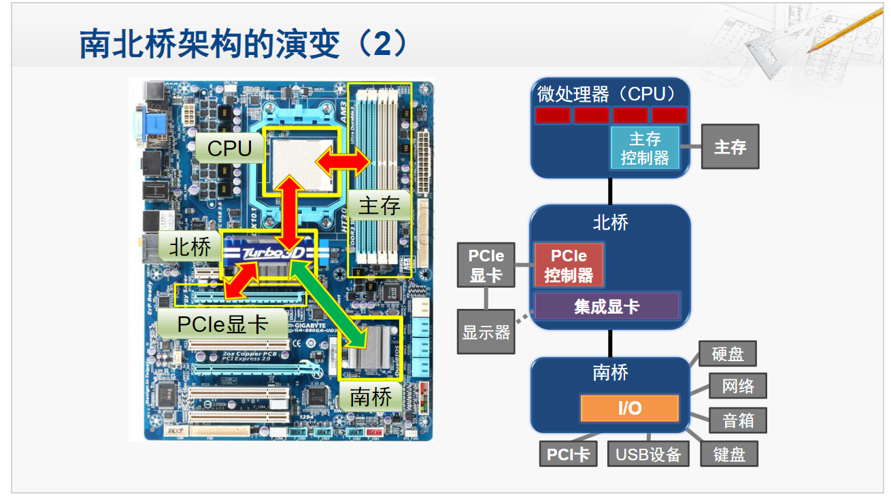

  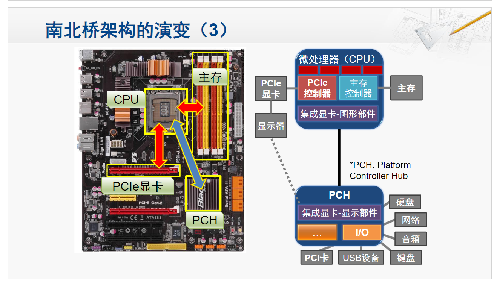
  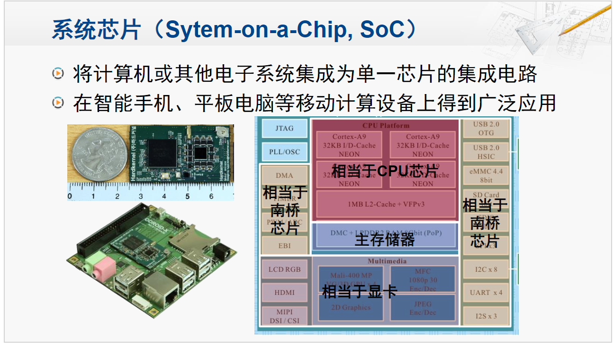

# :scroll: 5.21 流水线优化技术

## :star2: 流水线基本概念
### :dizzy: MIPS 的主要步骤

对 MIPS 处理器亦进行阶段划分: 

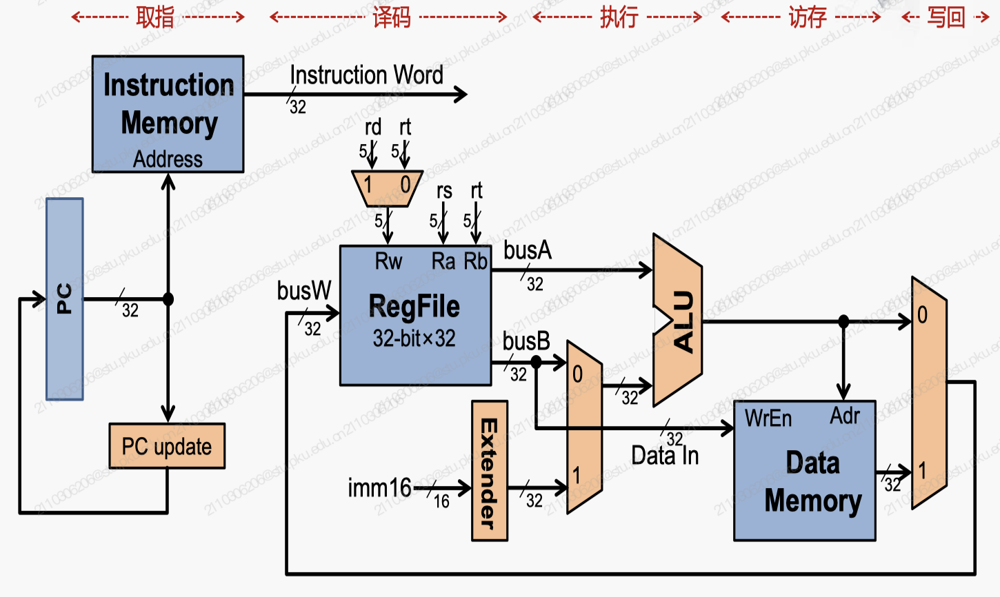

虽然分组了, 但是所有的信号都需要在每个阶段中保持稳定. 为了充分利用硬件, 我们添加寄存器: 

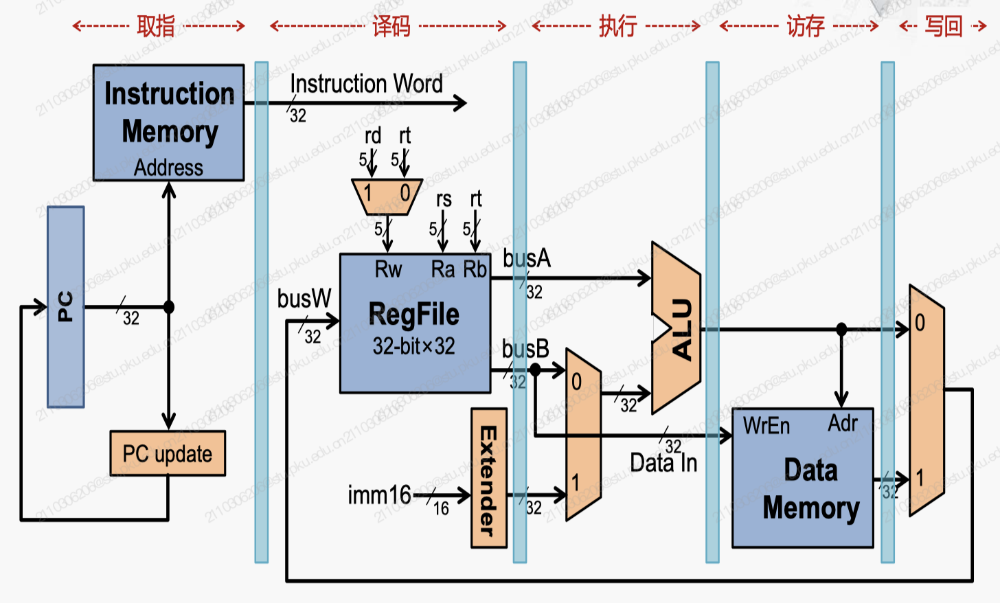

### :dizzy: 流水线处理器性能分析

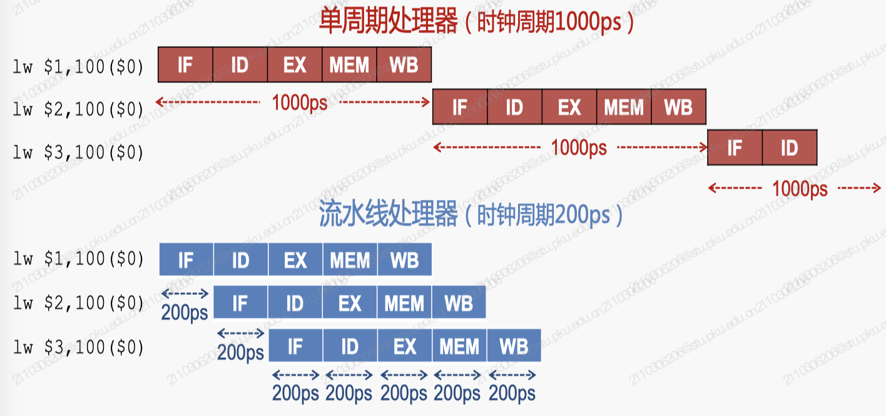

时钟周期: 流水线处理器的时钟周期是流水线中 **最慢的阶段的时钟周期**

这是没带上流水线寄存器的, 带上之后: 

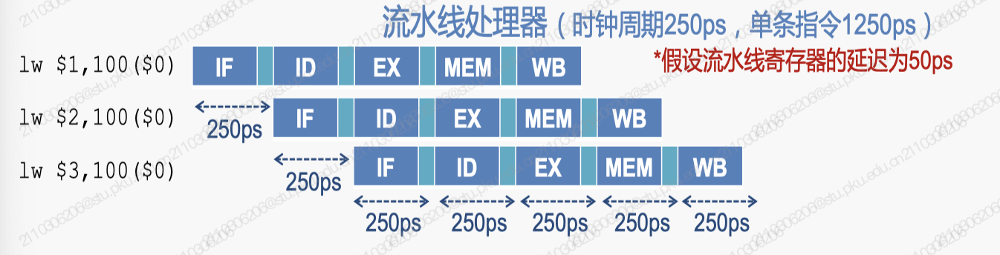

- 流水线中的各个处理部件可 **并行工作**, 从而可使 **整个程序** 的执行时间缩短

- 流水线并 **不会缩短单条指令的执行时间**  (甚至由于流水线寄存器的存在, 会增加时间)  , 而是 **提高了指令的吞吐率**

## :star2: 流水线的优化

### :dizzy: 流水线的调整

不平衡的流水线: 每个阶段花费时间不相等的流水线, 对单一条指令执行时间和整个处理器的吞吐率都不好. 

因此, 需要尽可能的平衡各个阶段的时间. 为此可能要更细地切分阶段, 使之变为平衡的流水线. 

**超级流水线技术 (Super Pipelining)**: 将流水线细分为更多的阶段, 增加流水线的深度提升时钟频率, 从而 **提高指令吞吐率**

但是流水线的级数不是越多越好, 因为有流水线寄存器的存在, 所以更深的级数会导致单条指令的延迟越来越大, 流水线寄存器延迟所占比例也越来越大, 填满一条流水线所需的指令也会增加. 

x86 被 RISC 追赶, 所以做出了改进: 在流水线内部用硬件把复杂的 x86 指令划分为更细的 RISC 指令, 从而既可以使用先进的 RISC 技术 (流水线等) , 也可以保证对原先的 x86 程序的兼容. 

2004, Pemtium 4 (Prescott) 达到了 31 级 (最高) . 

现在我们已经很难简单的通过增加流水线的深度来获得性能上的提升了. 

### :dizzy: 超标量流水线

**超标量 (Superscalar)**: 具有两条或两条以上 **并行工作** 的流水线结构称为 **超标量结构**

-   亦称为 "超标量流水线" 或直接称为 "超标量". 
-   与之相对, 之前的流水线则称为 "标量流水线"

使用超标量结构的处理器称为 **超标量处理器**

几条流水线就称为几发射. 

#### :dash: Pentium 的超标量流水线 (第一款超标量 x86 CPU) 

双发射, 5 级流水线

-   两条流水线: "U 流水" 和 "V 流水"
-   共用取值、译码阶段
-   每条流水线都拥有自己的地址生成逻辑、ALU 及数据 Cache 接口
-   在一个时钟周期内, 可以 **同时发送两条指令**

- Intel Core i7 : 4发射, 16级流水

## :star2: 转移指令的影响
- 改变指令流向, 破坏流水模式
- 流水线越深, 超标量数越多, 转移指令的影响越大
$$\text{Pipeline stall cycles from branches}\\
=\text{ Branch Frequency} \times\text{Branch Penalty}$$

- Pipeline Stall Cycles : 流水线停顿周期, 每条指令平均因分支额外消耗的周期数
- Branch Frequency : 分支指令的频率, 每条指令中分支指令的平均比例
- Branch Penalty : 分支惩罚, 每条分支指令平均造成的流水线停顿周期数

### :dizzy: 转移开销
转移开销的构成: 
- 要不要转移
- 转移到哪里

如转移被执行, 且确实发生转移时, 产生如下"转移开销":
- 将按顺序预取的指令废除(排空流水线)
- 从转移目标地址重新取指令

### :dizzy: 减少转移指令影响的技术
#### :dash: 延迟转移(Delayed Branch)技术
-  在转移指令后面插入多条指令, 使得转移指令的执行延迟多个时钟周期
#### :dash: 转移预测技术 (其实是分支预测 Branch Prediction)
- 转移条件判定的预测 : 要不要转移
- 转移目标地址的预测 : 转移到哪里
- 实现要求:
  - 必须能够验证转移预测的结果
  - 预测失败时能恢复正确的执行方式

## :star2: 转移预测技术
### :dizzy: 要不要转移?
#### :dash: 方法
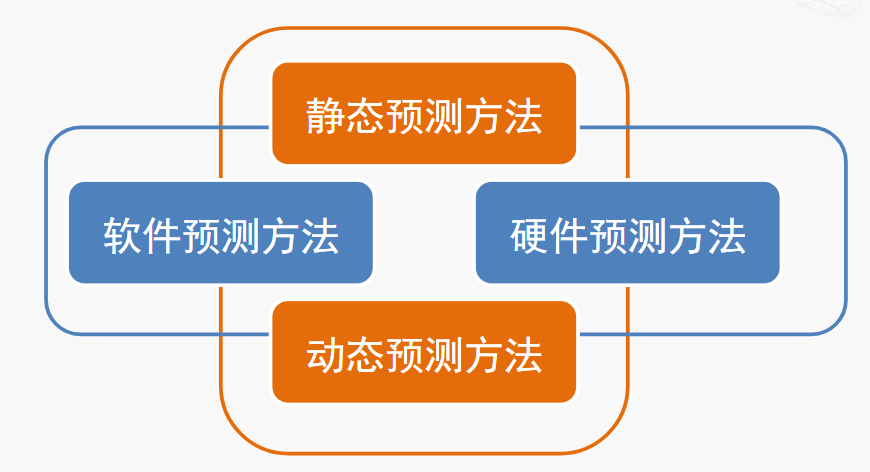
##### 硬件固定预测不转移
在转移条件判定之前总是顺序地取下一条指令
- 优点: 实现简单; 缺点: 预测效果不佳

##### 编译制导的预测
在转移指令的编码中增加 1 位, 编译器设置该位来通知硬件预测是跳转还是不跳转
- 优点 : 软件可根据指令类型和历史信息, 对不同指令进行不同的预测
- 缺点 : 
  - 需要软件支持
  - 需要修改 ISA (指令集架构)
  - 不适应多变的执行环境

##### 基于偏移的预测
如果转移指令地址和转移目标地址的相对偏移位负值 (可能是循环结束), 则预测转移, 否则预测不转移

##### 基于历史信息的预测
- 当前普遍采用
- 转移与否取决于先前的转移指令的执行情况
- 设计需要考虑 : 跟踪多少历史信息; 对各种历史信息做何种先验

#### :dash: 历史信息转移
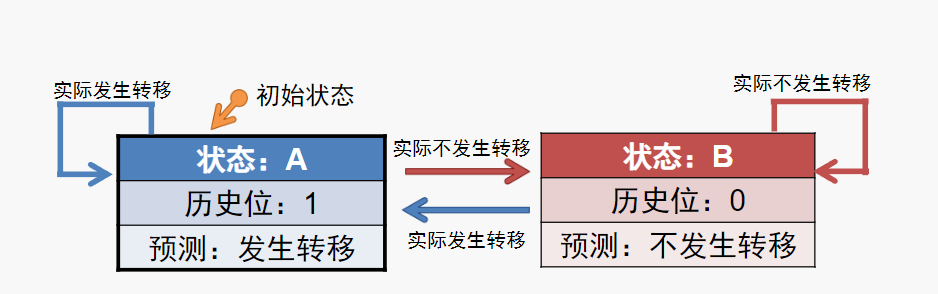
- 在取指部件中, 维护转移指令的历史信息

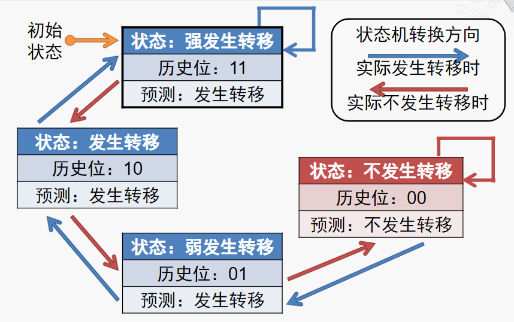

- Pentium 的两位历史信息转移预测器 :arrow_up: 
  - 11 : 强发生状态 (strongly taken)
  - 10 : 发生状态 (taken)
  - 01 : 弱发生状态 (weakly taken)

- 历史位的设定也可以有不同于 Pentium 的方式, 例如如下是一种相对无倾向性的设定

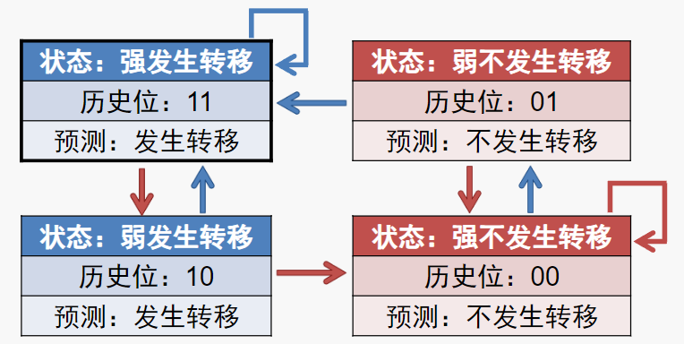

- 进一步优化 : 对于循环程序, 首次进入循环和退出循环两种情况下可能需要重新计算转移地址, 并造成流水线的停顿和等待

> 假如有一段循环 n 次的代码被**反复调用**
> - 若使用 1 位历史信息, 每轮调用时, 2 次预测错误 n-2 次正确
> - 若使用 2 位历史信息, 每轮调用时, 1 次预测错误 n-1 次正确

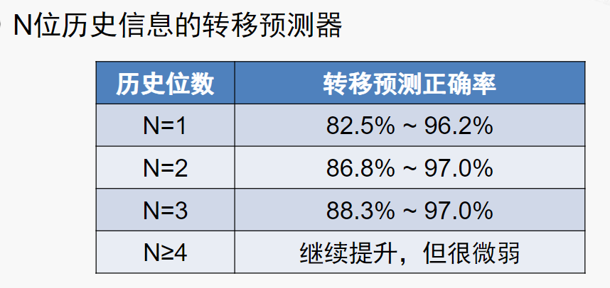

### :dizzy: 转移到哪里?
转移目标缓冲器 BTB (Branch Target Buffer)
- 维护此前转移指令的目标地址
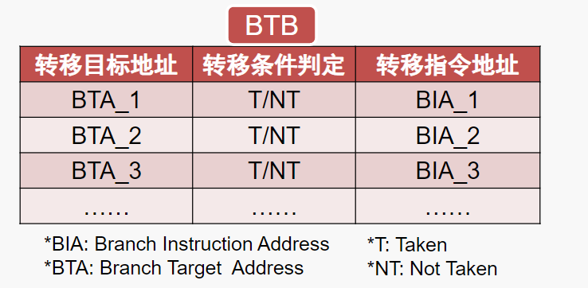

#### :dash: BTB 表项比较
  - 将需要预测的指令与 "转移指令地址" 比较, 若有一项匹配, 则称为 BTB"命中"
  - 若命中, 且转移条件判定为 "发生转移", 则从 BTB 中取出对应的 "转移目标地址" 作为预测结果
  - 最终执行后得到 "目标地址" 和 "条件判定" 需要与预测比较, 如不一致需更新 BTB

#### :dash: BTB 比较时机
- 与取指同时 (Xscale)
  - 优点 : 在流水线较早阶段获得目标转移地址
  - 缺点 : 每条指令需访问 BTB, 功耗开销较大
- 译码完成后 (Pentium)
  - 优点 : 转移指令才需访问BTB，功耗开销较小
  - 缺点 : 在流水线较晚阶段获得转移目标地址
- 预译码完成后, 取指的同时 (UltraSPARC III)
  - 兼具二者之长

#### :dash: BTB 工作机制

比较直观, 不赘述每一步

## :star2: 返回地址栈
- 特殊的转移指令 : "过程返回"指令 RET
- 专用的预测部件 : 返回地址栈 (Return Address Stack, RAS) 
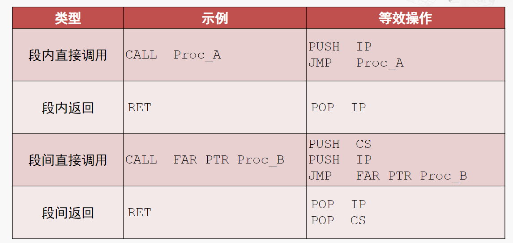

### :dizzy: 过程返回的特点
- 优点
  - 均为**无条件**转移
  - **早**在"过程调用"时生成
  - 过程调用和返回的地址成对出现 (可**预测**)
- 缺点
  - 转移目标地址往往不同
  - 转移目标地址在存储器, 访问耗时
  - 到流水线晚期才访问存储器活动转移目标地址
### :dizzy: RAS的工作原理
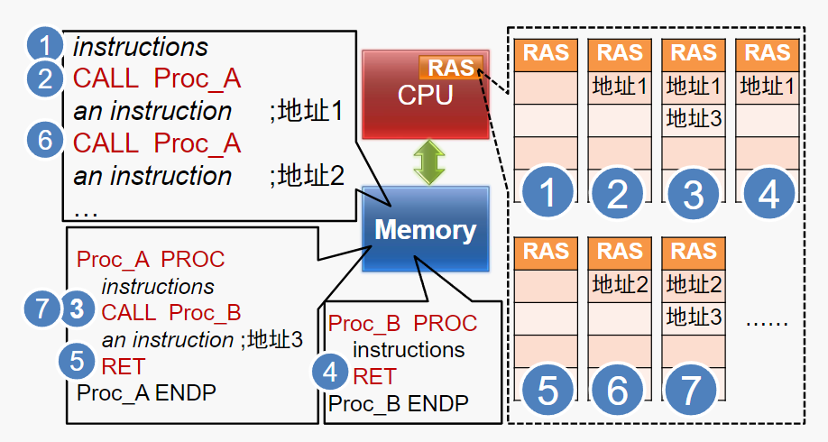
这个图也很直观

# :scroll: 5.24 & 6.2 计算机系统先进技术

## :star2: 片上互联
- 片上总线难以满足需求:
  - 当主模块1长时间等待从模块2返回读数据时, 造成了大量与此无关的传输无法发起
- 引入 AXI 总线:
  - AXI实质上并不是总线, 而是介于总线和网络之间的互连结构
- 片上网络借鉴了计算机网络的分组交换思想, 将通信抽象为路由节点 + 数据包的分布式架构, 解决了总线的核心问题:
  - 吞吐率问题 : 并行传输
  - 信号延迟问题 : 可预测
  - 信号完整性问题 : 数据纠错, 重传机制
  - 全局同步问题 : 全局异步, 局部同步
  - 功耗问题 : 高效率
## :star2: 内存技术发展
SDR (Single Data Rate) 与 DDR (Double Data Rate) 的区别 :
- 前者只在时钟上升沿传输数据, 而后者在时钟的上升沿和下降沿都传输数据, 因此 DDR 的数据传输速率是 SDR 的两倍

DDR 4 SDRAM 的特点 :
- 采用了 Bank Grouping 技术, 将内存分为多个 Bank Group, 每个 Bank Group 内部可以独立访问, 提高了并行性

## :star2: MSI 中断机制
问题 : 当PCI设备使用DMA方式写存储器时, 该设备在最后一个数据离开其发送FIFO时, 会认为DMA写操作已经完成. 此时这个设备将通过INTx信号通知处理器. 但是当处理器收到中断信号时, 并不意味着PCI设备已经将数据写入存储器中.
- 解决方案1 : PCI设备保证在数据到达目的地之后, 再提交中断请求
  - 开销大, 不容易实现, 还将增加中断请求的延时
- 解决方案2 : 中断服务程序先读取PCI设备中断状态寄存器, 判断中断产生原因后, 才对PCI设备写入的数据进行操作
  - 绝大多数处理器系统采用这个方法, 一方面可以**获得设备的中断状态**, 另一方面**保证 DMA 写的数据最终到达存储器**. 如果不这样做, 可能产生数据完整性问题.
> 现实情况即便中断服务程序没有先读取 PCI 设备的寄存器, 一般也不会出现问题. 但一但出错难以定位. 

MSI (Message Signaled Interrupts) 中断机制 :
- MSI是PCIe引入的基于消息的中断机制, 取代传统的INTx信号

- 优点 : 
  - 解决了多个设备共享同一中断信号 (INTx引脚) 的问题
  - 解决了每个功能设备只支持一个中断的问题
  - "异步"中断的数据完整性问题
- 缺点 : 要占用总线带宽
## :star2: 指令系统
ARM 指令格式的特点:
- 寄存器编号位域只有 4 位, 只能寻址 16 个通用寄存器
- 功能位域位置不统一, 给指令译码带来不便
- 所有的ARM指令都带有 4 位的条件码, 都可以条件执行

x86 指令系统的理念
- 兼容性
  - 每款处理器包含该系列早期处理器的全部指令  
  - 每款处理器包含该系列早期处理器的寄存器和操作方式
- 指令系统的增强和扩充 (每款处理器)
  - 对已有指令进行功能上的扩展和改进
  - 增加新指令
## :star2: 并行结构
- Flynn分类法
  - SISD (单指令流单数据流)
  - SIMD (单指令流多数据流)
  - MISD (多指令流单数据流)
  - MIMD (多指令流多数据流)

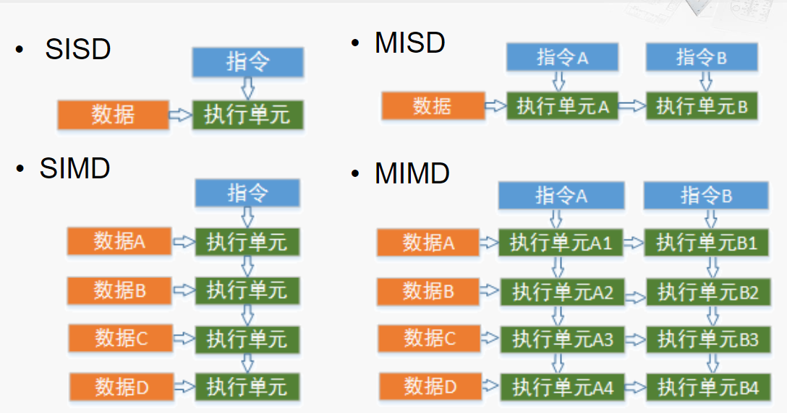

- MMX Data Types : 
  - Packed Byte: 8 bytes packed into 64 bits
  - Packed Word: 4 words packed into 64 bits
  - Packed Doubleword: 2 doublewords packed into 64 bits
  - Packed Quadword: One 64-bit quantity

- 饱和运算 (Saturation Arithmetic) : 当运算结果超过数据类型能表示的最大值或最小值时, 结果会被 "截断" 到该类型的最大值或最小值, 而不是像模运算 (Modular Arithmetic) 那样回绕 (wrapping around).常用于图形处理